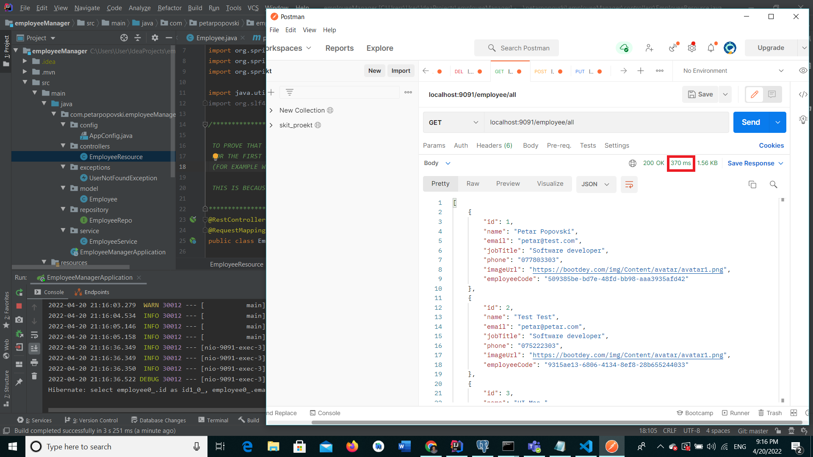
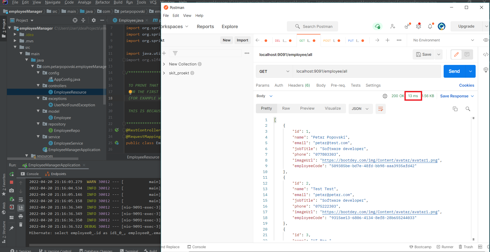

# Employee Manager Backend application

Simple Spring Boot application using PostgreSQL database and Redis caching 

## Stack
#### Backend: 
- Spring boot framework for Java
- Simple REST API to expose the CRUD functionalities
- PostgreSQL database for storage
- Redis for caching the most used data

#### Frontend:
- Angular
- Bootstrap

### Before caching with Redis

### After caching with Redis

